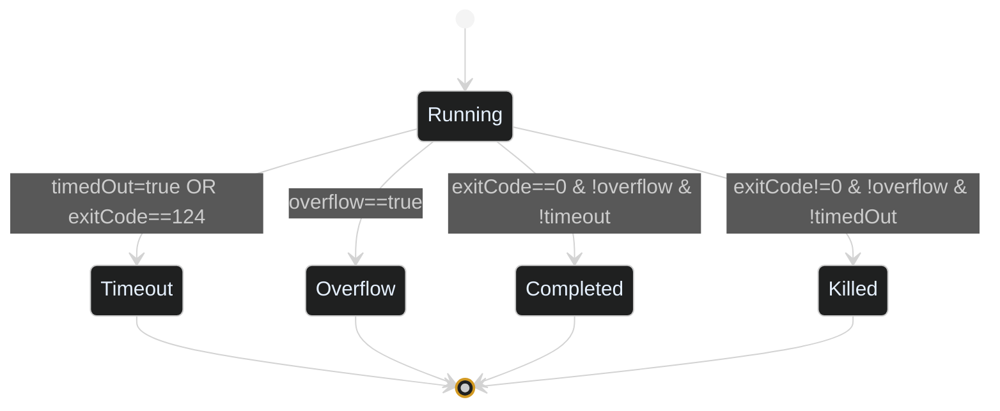
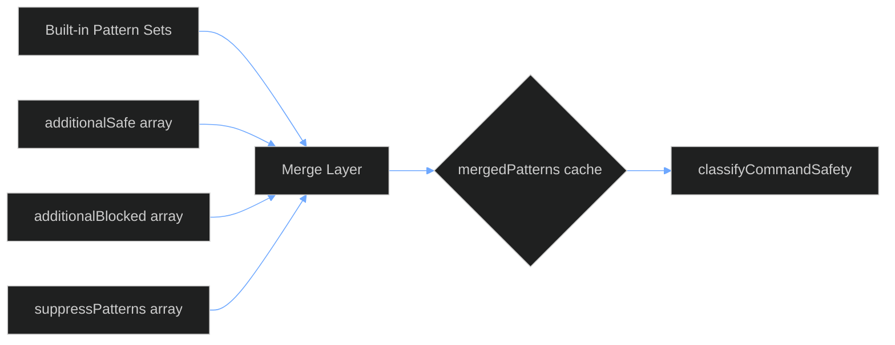

# PowerShell MCP Server Architecture & Logical Diagrams

> Comprehensive technical overview of the enterprise PowerShell MCP Server: component architecture, request lifecycle, security classification logic, enforcement pathways, observability flows, adaptive timeout behavior, and auxiliary tooling. (Updated: Aug 2025)

---

## 1. High-Level Component Architecture (Updated Aug 2025)

```mermaid
%%{init: {'theme':'dark','themeVariables': { 'primaryColor': '#1e2730','primaryTextColor':'#e6f1ff','primaryBorderColor':'#4fa3ff','lineColor':'#6ea8ff','secondaryColor':'#2a3542','tertiaryColor':'#16202a','nodeTextColor':'#e6f1ff','clusterBkg':'#111a23','clusterBorder':'#4fa3ff','noteBkgColor':'#2d3640','noteTextColor':'#e6f1ff','fontFamily':'Segoe UI,Inter,Arial'}}}%%
flowchart LR
    subgraph Client Side
        A[AI Assistant / MCP Client]
    end
    A -- stdio (MCP Protocol) --> T[Stdio Transport]
    T --> C[Core MCP Server]

    subgraph Core Runtime
        C --> TOOLREG[Tool Registry]
        C --> AUTH[Auth Validator]
        C --> RL[Rate Limiter]
        C --> SEC[Security Classifier]
        C --> WD[Working Directory Policy]
        C --> EXEC[PowerShell Executor]
        C --> LOG[Audit Logger]
        C --> THREAT[Threat / Alias Tracker]
        C --> METRICS[Metrics Registry]
        C --> PROMPTS[Prompt Retrieval]
        C --> CONFIG[Enterprise Config Loader]
        C --> GITTOOLS[Git Tool Surface]
    end

    EXEC --> PS[PowerShell Host]
    SEC --> PATTERNS[Pattern Sets + Dynamic Overrides]
    METRICS --> HTTP[(HTTP / SSE Server)]
    GITTOOLS --> EXEC
    HTTP --> DASH[Browser Dashboard]
    LOG --> FILES[(Log Files + NDJSON)]
    THREAT --> METRICS
        else Within Limit
    End of Updated Architecture Document
    ## 10. Execution Output Struct (Simplified)
            Server->>Sec: classify(command)
    ```mermaid
    %%{init: {"theme":"dark","themeVariables": { 
        "primaryColor": "#1e2730",
        "primaryTextColor":"#e6f1ff",
        "primaryBorderColor":"#4fa3ff",
        "lineColor":"#6ea8ff",
        "secondaryColor":"#2a3542",
        "tertiaryColor":"#16202a",
        "noteBkgColor":"#2d3640",
        "noteTextColor":"#e6f1ff",
        "classTextColor":"#e6f1ff",
        "classTitleColor":"#ffffff",
        "classBackground":"#1e2730",
        "classBorderColor":"#4fa3ff",
        "fontFamily":"Segoe UI,Inter,Arial"
    }}%%
    classDiagram
        class PowerShellExecutionResult {
            +bool success
            +string stdout
            +string stderr
            +int? exitCode
            +int duration_ms
            +string command
            +string? workingDirectory
            +SecurityAssessment securityAssessment
            +int? processId
            +bool? timedOut
            +string? error
        }
    ```
            Sec-->>Server: SecurityAssessment
            alt Blocked Assessment
                Server->>Client: Blocked inline result
                Log-->>(Files): COMMAND_BLOCKED
                Metrics-->>Dashboard: execution(blocked)
            else Requires Confirmation (RISKY/UNKNOWN)
                alt confirmed flag missing
                    Server->>Client: McpError (Needs confirmed:true)
                    Log-->>(Files): CONFIRMATION_REQUIRED
                else confirmed present
                    Server->>Exec: spawn PowerShell (+ self-destruct timer)
                    Exec-->>Server: ExecutionResult (terminationReason)
                    Server->>Client: structured output
                    Log-->>(Files): COMMAND_EXECUTED
                    Metrics-->>Dashboard: execution(success/fail)
                end
            else Safe
                Server->>Exec: spawn PowerShell
                Exec-->>Server: ExecutionResult
                Server->>Client: structured output
                Log-->>(Files): COMMAND_EXECUTED
                Metrics-->>Dashboard: execution(success/fail)
            end
            Sec-->>Log: classification entry
            Sec-->>Metrics: increment counters
        end
    end
```text

---

## 3. Security Classification Logic (Decision Flow)

```mermaid
%%{init: {"theme":"dark","themeVariables": { "primaryColor": "#1e2730","primaryTextColor":"#e6f1ff","primaryBorderColor":"#ff7b72","lineColor":"#ffb347","secondaryColor":"#2a3542","tertiaryColor":"#16202a","fontFamily":"Segoe UI,Inter,Arial"}}}%%
flowchart TD
    A[Input Command] --> B[Alias / Suspicious Checks]
    B --> C{High-Risk Alias\nor Suspicious?}
    C -->|Yes| CRIT[[CRITICAL BLOCK]]
    C -->|No| D[Merge Dynamic\nPatterns]
    D --> E{Blocked Regex?}
    E -->|Yes| BLK[[BLOCKED]]
    E -->|No| F{Danger Fallback?}
    F -->|Yes| DANG[[DANGEROUS]]
    F -->|No| G{RISKY Regex?}
    G -->|Yes| RISKY[[RISKY\nNeeds Confirm]]
    G -->|No| H{SAFE Regex?}
    H -->|Yes| SAFE[[SAFE]]
    H -->|No| UNK[[UNKNOWN\nNeeds Confirm]]
```

(Section unchanged in logic; see previous revision for outcome table.)

---

## 4. Adaptive Timeout Lifecycle

```mermaid
%%{init:{'theme':'dark','themeVariables':{'primaryColor':'#1e2730','primaryTextColor':'#e6f1ff','primaryBorderColor':'#4fa3ff','lineColor':'#4fa3ff','secondaryColor':'#2a3542'}}}%%
flowchart LR
    START[Start Execution] --> BASE[Base Timeout (configuredTimeoutMs)]
    BASE --> CHECK{Remaining <= extendWindow?}
    CHECK -->|No| ACTIVITY_WAIT[Wait / Collect Output]
    ACTIVITY_WAIT --> CHECK
    CHECK -->|Yes| RECENT{Recent Activity?}
    RECENT -->|No| ACTIVITY_WAIT
    RECENT -->|Yes| CAP{Would Extension <= maxTotal?}
    CAP -->|No| LOCK[Reach Hard Cap]
    CAP -->|Yes| EXTEND[Extend Timeout (extendStepMs)]
    EXTEND --> CHECK
    LOCK --> EXPIRY[Timeout Fires]
    EXTEND --> EXPIRY
    EXPIRY --> TERMREASON[terminationReason=timeout]
```

**Key Fields Added:**
- `effectiveTimeoutMs` – final external timeout after extensions
- `adaptiveExtensions` – count of successful extensions
- `terminationReason` – canonical end-state classification

---

## 5. Termination Reason State Machine



Assignments:
- Timeout path sets `terminationReason='timeout'`
- Overflow detection sets `terminationReason='overflow'`
- Non-zero exit without flags → `killed`
- Clean success → `completed`

Integrity tests ensure mutual exclusivity.

---

## 6. (Sections 5–19 retained, plus appended notes)

The remaining sections (Rate Limiter, Working Directory Enforcement, Metrics & Observability, Threat Tracking, Prompt Retrieval, Tool Surface, Execution Output Struct, Enforcement Summary, Scenarios, Overrides, Audit Surfaces, Failure Modes, Mental Model, Extensibility, Glossary, Summary) remain structurally identical to prior version except for these additive notes:

### Additive Notes
- `run-powershell` now returns `terminationReason` for deterministic downstream analytics.
- Hang test command preserved in `tests/jest/run-powershell-timeout-hardening.test.js` & `docs/CRITICAL-TIMEOUT-COMMANDS.md`.
- Adaptive timeout never extends beyond `adaptiveMaxTotalSec`; internal self-destruct timer is aligned to that ceiling.
- Watchdog escalation (hardKillTotal) sets `terminationReason='killed'` if no prior classification.
- Obsolete `METRICS_TRACE` flag removed; optional port reclaim guarded by `METRICS_PORT_RECLAIM=1` to avoid unintended steals.

---

## 20. Field Matrix (Execution Result – Delta Focus)

| Field | Type | Source | When Present | Example |
|-------|------|--------|--------------|---------|
| configuredTimeoutMs | number | Input derived | Always | 1000 |
| effectiveTimeoutMs | number | Adaptive loop | Adaptive / always | 2500 |
| adaptiveExtensions | number | Adaptive loop | Adaptive only | 3 |
| adaptiveExtended | boolean | Adaptive loop | Adaptive only | true |
| terminationReason | enum | Executor | Always | timeout |
| internalSelfDestruct | boolean | PS timer | If exit 124 | true |
| watchdogTriggered | boolean | Watchdog | Rare (stuck close) | true |
| killEscalated | boolean | Kill escalation | If second-stage kill | true |

---

## 21. Testing Additions

| Test | Purpose |
|------|---------|
| timeout hardening | Validates warnings, cap, forced hang duration threshold |
| adaptive timeout | Verifies extensions & terminationReason=completed |
| fast-exit control | Ensures quick command not misclassified as hang |
| termination integrity (implicit) | Validates `timeout` path sets proper reason |

---

## 22. Future Architecture Hooks

Planned (not yet merged):
- Cancellation tokens bridging client abort → process kill
- Structured `terminationReasonDetail` (e.g. `internalSelfDestruct`, `watchdog`) layering under main enum
- Metrics dimension for termination reason distribution

---

End of Updated Architecture Document
%%{init: {"theme":"dark","themeVariables": { 
    "primaryColor": "#1e2730",
    "primaryTextColor":"#e6f1ff",
    "primaryBorderColor":"#4fa3ff",
    "lineColor":"#6ea8ff",
    "secondaryColor":"#2a3542",
    "tertiaryColor":"#16202a",
    "noteBkgColor":"#2d3640",
    "noteTextColor":"#e6f1ff",
    "classTextColor":"#e6f1ff",
    "classTitleColor":"#ffffff",
    "classBackground":"#1e2730",
    "classBorderColor":"#4fa3ff",
    "fontFamily":"Segoe UI,Inter,Arial"
}}%%
classDiagram
    class PowerShellExecutionResult {
        +bool success
        +string stdout
        +string stderr
        +int? exitCode
        +int duration_ms
        +string command
        +string? workingDirectory
        +SecurityAssessment securityAssessment
        +int? processId
        +bool? timedOut
        +string? error
    }
```

---

## 11. Security Enforcement Summary

| Phase | Step | Condition | Action | Response Pattern |
|-------|------|-----------|--------|------------------|
| 1 | Auth | Key invalid (enterprise) | Reject | McpError AUTH_FAILED |
| 2 | Rate Limit | tokens == 0 | Reject + log + metrics | McpError RATE_LIMIT_EXCEEDED |
| 3 | Classification | blocked=true | Reject + log + metrics | McpError COMMAND_BLOCKED |
| 4 | Classification | requiresPrompt & !confirmed | Reject | McpError CONFIRMATION_REQUIRED |
| 5 | Execution | timeout | Kill process | error TIMEOUT |
| 6 | Output | size/lines exceed | Truncate | Append &lt;TRUNCATED&gt; marker |

---

## 12. Example Interaction Scenarios

### A. Safe Command

```json
{
    "tool": "powershell-command",
    "params": { "command": "Get-Date" }
}
```

- Classified SAFE → executes directly.
- Returns success, securityAssessment.level = SAFE.

### B. Risky Command Without Confirmation

```json
{
    "tool": "powershell-command",
    "params": { "command": "Remove-Item ./file.txt" }
}
```

- Classified RISKY → requiresPrompt.
- Missing `confirmed:true` → McpError advising to add confirmation.

### C. Risky Command With Confirmation

```json
{
    "tool": "powershell-command",
    "params": { "command": "Remove-Item ./file.txt", "confirmed": true }
}
```

- Executes; audit logs include confirmation intent.

### D. Critical Command Attempt

```json
{
    "tool": "powershell-command",
    "params": { "command": "powershell -EncodedCommand abc..." }
}
```

- Classified CRITICAL → blocked; no execution spawned.

### E. Unknown Command

```json
{
    "tool": "powershell-command",
    "params": { "command": "Custom-InternalThing" }
}
```

- Classified UNKNOWN → requiresPrompt.
- Tracked in unknownThreats map for frequency.

---

## 13. Dynamic Pattern Overrides



- Lazy initialization caches merged regex arrays (safe, risky, blocked).
- suppressPatterns filters out built-ins before compilation.

---

## 14. Operational Audit Surfaces

| Surface | Content | Format | Primary Use |
|---------|---------|--------|-------------|
| stderr | Human-readable log lines | Text | Real-time console monitoring |
| .log file | Pretty JSON entries | Text | Manual audit review |
| .ndjson | Structured line-delimited JSON | JSON | Machine ingestion (SIEM) |
| /api/metrics | Current metrics snapshot | JSON | Polling, dashboards |
| /events | Streaming events | SSE | Live UI updates |

---

## 15. Failure Modes & Mitigations

| Failure | Detection | Mitigation | Logged As |
|---------|-----------|-----------|----------|
| Auth failure | authKey mismatch | Reject request | AUTH_FAILED |
| Rate limit exceeded | token bucket empty | Backoff & retry | RATE_LIMIT_EXCEEDED |
| Blocked command | classification.blocked | Inform & suggest safe alternative | COMMAND_BLOCKED |
| Missing confirmation | requiresPrompt & !confirmed | Ask for confirmed:true | CONFIRMATION_REQUIRED |
| Timeout | exec duration > timeout | Kill process | TIMEOUT / TIMEOUT_AND_TRUNCATED |
| Excess output | bytes/lines > limit | Append truncate indicator | OUTPUT_TRUNCATED |

---

 
## 16. Quick Mental Model

> "Every request is a mini pipeline: Authenticate → Rate Limit → Classify → (Confirm?) → Execute → Log → Stream Metrics."

---

## 17. Extensibility Hooks

| Area | Extension Strategy |
|------|--------------------|
| New Tools | Add to tool list & switch in `CallTool` handler |
| New Security Patterns | Add dynamic config arrays (additionalBlocked) |
| Custom Compliance | Post-process NDJSON logs into SIEM pipeline |
| Advanced Metrics | Extend metricsRegistry & SSE payload schema |
| Plugin Prompts | Append new headings in `AGENT-PROMPTS.md` for tool retrieval |

---

## 18. Glossary

| Term | Definition |
|------|------------|
| SecurityAssessment | Structured result describing risk, level, reason, and enforcement flags. |
| requiresPrompt | Flag indicating user/agent must explicitly confirm execution. |
| blocked | Hard stop; command never reaches executor. |
| UnknownThreatEntry | Tracked record for unclassified commands. |
| Token Bucket | Rate limiting algorithm controlling request bursts over time. |
| NDJSON | Newline Delimited JSON, one JSON object per line. |

---

 
## 19. Summary

The server blends deterministic security classification, explicit confirmation semantics, rigorous audit logging, proactive threat tracking, and live observability. Diagrams above map each logical layer so agents and humans can reason about trust boundaries, side effects, and extension points.

### Timeout Escalation (Implementation Note)

Execution timeouts now perform a two‑stage termination: SIGTERM at the configured threshold followed by an automatic SIGKILL escalation after a short grace window (min 2s, max 5s, ~10% of timeout). Metrics record each timeout (TIMEOUTS counter) and dashboard rows display a TIMEOUT marker when `timedOut=true`.

---
End of Architecture Document

---

## 20. Unified Server & Framer Modes (Aug 2025 Update)

Recent refactor consolidated legacy `vscode-server*.ts` entrypoints into a single `server.ts` which conditionally supports three stdio transport modes:

| Mode | Trigger | Use Case | Notes |
|------|---------|----------|-------|
| SDK (default) | none | Normal production | Uses MCP SDK `StdioServerTransport`. |
| Minimal Framer | `--minimal-stdio` | Low-level initialize debugging | Limited tool surface; skips full metrics/auth; verbose byte logs. |
| Enterprise Framer | `--framer-stdio` | Diagnose transport anomalies with full feature set | Bypasses SDK transport, preserves full tool registry, metrics, security. |

Both framer modes implement a simple `Content-Length: <n>\r\n\r\n` envelope. Enterprise framer shares the same dispatcher, avoiding code duplication. This refactor removed divergence between enterprise & legacy servers and simplified future feature rollout (single patch surface).

### Deprecations

Legacy compiled outputs (`vscode-server-enterprise.js`, `vscode-server.js`) are deprecated. Start scripts should target `dist/server.js`.

---

## 21. Adaptive Timeout Mechanism

Previous implementation used competing timers (static + adaptive extension) causing races. The new model introduces a single monitor loop with these parameters (user arguments or defaults):

| Parameter | Meaning | Default |
|-----------|---------|---------|
| `adaptiveExtendWindowMs` | Time window where progress (stdout/stderr or chunk activity) allows extensions | 4000 |
| `adaptiveExtendStepMs` | Increment applied when progress observed | 1000 |
| `adaptiveMaxTotalSec` | Hard ceiling on total runtime (prevents endless extension) | 120 (cap by global limit) |
| Grace Period | Fixed short window after final extension before termination | ~1000ms |

Algorithm (simplified):

1. Start deadline = requested timeout.
2. Every 250ms monitor loop checks for new output/activity within extend window.
3. If activity and total < maxTotal, extend deadline by `adaptiveExtendStepMs` (record event in `adaptiveLog`).
4. On reaching deadline without activity: enter grace; if still idle at grace end, terminate.
5. All timing decisions flow through one code path → no race with a separate static timer.

Response exposes: `adaptiveLog[]`, `effectiveTimeoutMs`, `timedOut`, and any warnings about deprecated fields or long durations.

---

## 22. Output Overflow Strategies

Large stdout/stderr can starve memory or bandwidth. Three strategies selectable via env `MCP_OVERFLOW_STRATEGY` (or default):

| Strategy | Behavior | Exit Code | Typical Use |
|----------|----------|-----------|-------------|
| return (default) | Respond immediately with partial collected output; kill process in background | 137 (synthetic) | Fast feedback to agent; minimize wasted compute |
| terminate | Aggressively SIGTERM (+ optional SIGKILL) once cap exceeded | 137/124 | Strict resource ceilings |
| truncate | Stop reading additional data, allow process to finish naturally | Actual process code | Keep best-effort final exit status |

Caps enforced: bytes (`limits.maxOutputKB`), lines (`limits.maxLines`). Metadata flags: `overflow:true`, `truncated:true`, `overflowStrategy:"..."`, `reason:"output_overflow"`.

---

## 23. PowerShell Process Metrics Sentinel

When enabled (`MCP_CAPTURE_PS_METRICS=1` or config flag), the PowerShell script footer emits a sentinel JSON line (never user output) with shape:

```jsonc
{ "__psMetrics": { "cpuSec": <number>, "wsMB": <number> } }
```

Executor logic:

1. Buffers stdout lines; searches backward for sentinel marker.
2. Parses metrics; removes sentinel from user-visible `stdout`.
3. Injects per-invocation metrics (`psCpuSec`, `psWSMB`) into execution record.
4. Aggregates arrays in `metricsRegistry` for avg & p95; surfaces at `/api/metrics` and Prometheus `/metrics`.

Design goal: zero dependency on external profilers; minimal overhead (<2–3ms parse) and safely ignorable when disabled.

---

## 24. Metrics HTTP Port Binding & Stability

The metrics HTTP server attempts to bind a preferred port (default 9090). On collision it performs controlled incremental retries. Tests depending on a stable port should set an env flag (`METRICS_STRICT=1`, planned) to fail fast rather than auto-increment. (Implementation note: strict mode wiring pending — see Observability Roadmap.)

---

## 25. Future Documentation Hooks

Planned sections to be added as features graduate:

- Cancellation & request abort pathway
- Policy plugin lifecycle
- Metrics reset endpoint
- Structured adaptive timeout tuning guide

---

## 26. Engineering Iteration & Troubleshooting Protocol (Internal)

This section defines the disciplined loop for making *behavioral* or *observability* changes. It exists to prevent patch stacking and regressions during rapid hardening cycles.

### 26.1 Loop Contract

Each iteration MUST record:

| Field | Description |
|-------|-------------|
| Hypothesis | Single root-cause theory being validated. |
| Change | Minimal code/doc/instrument delta applied to test hypothesis. |
| Expected Evidence | Concrete new observable (log tag, JSON field, metric count). |
| Verification Command | Exact test or manual invocation producing evidence. |
| Outcome | Pass / Fail + observed data snippet. |
| Action | Proceed (if evidence seen & points to next step) OR Revert (if evidence absent). |

### 26.2 Revert-First Policy

If Expected Evidence is *not* observed on the very next run, the change is **reverted or wrapped behind a feature flag** before attempting a different approach. This prevents “patching patches”.

### 26.3 Instrument vs Behavior

Two categories of diffs:

- Instrumentation (debug only): Guarded by env flag (`METRICS_DEBUG`). Any ephemeral probes must be removed after evidence captured.
- Behavioral: Alters execution outcome or protocol surface. Requires doc update in same commit (README / ARCHITECTURE / TROUBLESHOOTING) and at least one test assertion.

### 26.4 Metrics Capture Troubleshooting Snapshot

See `docs/TROUBLESHOOTING.md` for end‑to‑end steps diagnosing PowerShell process metrics (`psSamples`). Core principles:

1. Prove emission (sentinel present in raw stream) **before** altering parser.
2. Prove parser extraction (temporary diagnostic JSON) **before** altering aggregation.
3. Only when both confirmed, adjust aggregation or snapshot exposure.

### 26.5 Temporary Flags

| Flag | Purpose | Default | Scope |
|------|---------|---------|-------|
| `METRICS_DEBUG` | Verbose stderr metrics lifecycle logs | off | Dev / CI diagnosis |
| `METRICS_STRICT` | Prevent port auto-increment for HTTP metrics | off | Tests needing deterministic port |
| `MCP_CAPTURE_PS_METRICS` | Enable single end-of-process sentinel emission & parsing | off | Opt‑in feature flag |
| `METRICS_PORT_RECLAIM` | Windows-only final attempt to reclaim original metrics port by terminating stale server.js holder | off | CI / local recovery |

### 26.6 Patch Ledger (Example Format)

```
| Seq | Date | Hypothesis | Change | Evidence Tag | Result | Follow-up |
|  01 | 2025-08-27 | Sentinel dropped | Add stderr + stdout sentinel | [METRICS][CAPTURE] | Absent -> Revert | Add TRACE JSON |
```

Maintain ledger in PR description or a temporary markdown until resolution, then archive (optional) or remove if noise.

---

>>>>>>> ade15a4 (chore: cleanup instrumentation, add port reclaim flag, enforce rate limiting, bump 1.2.1)
