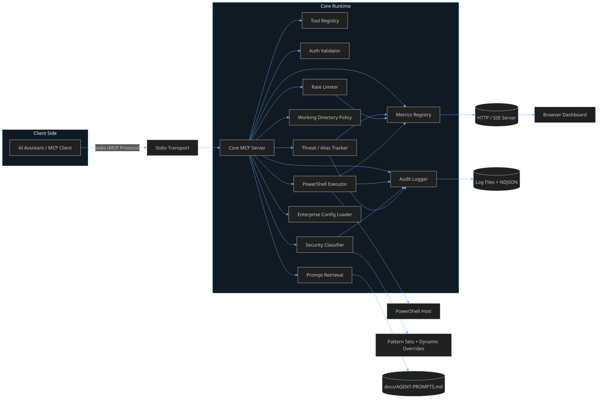
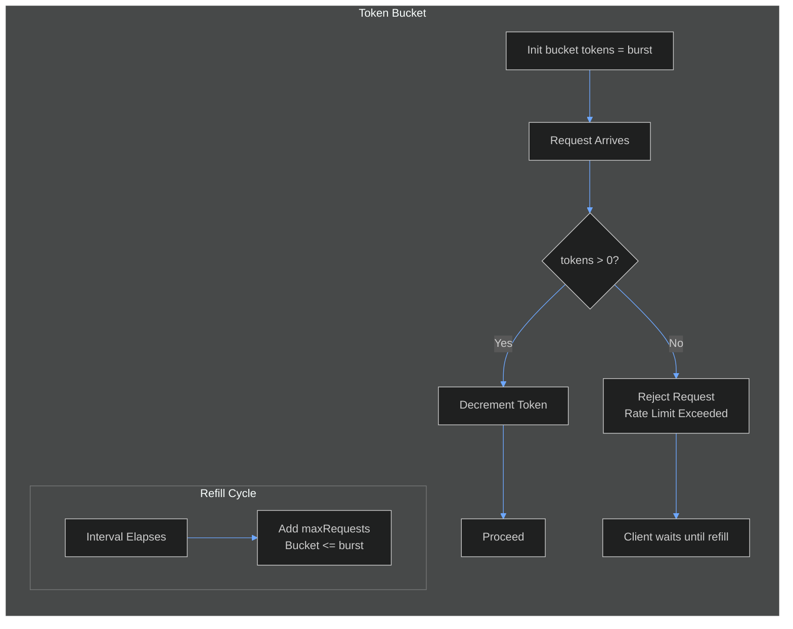
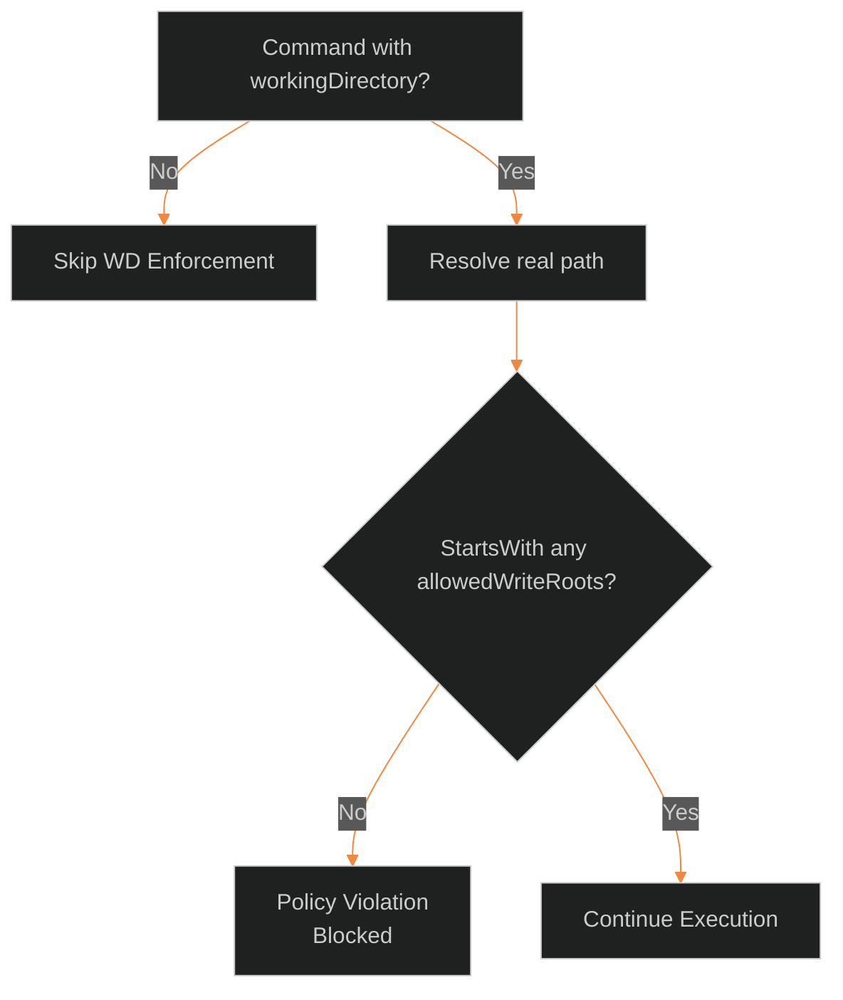
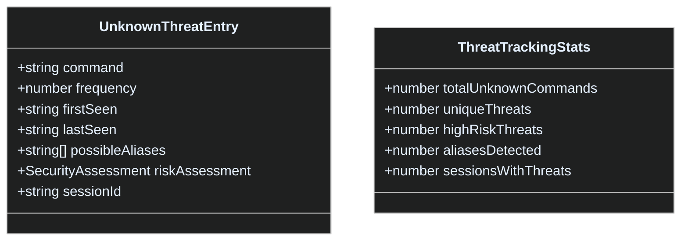
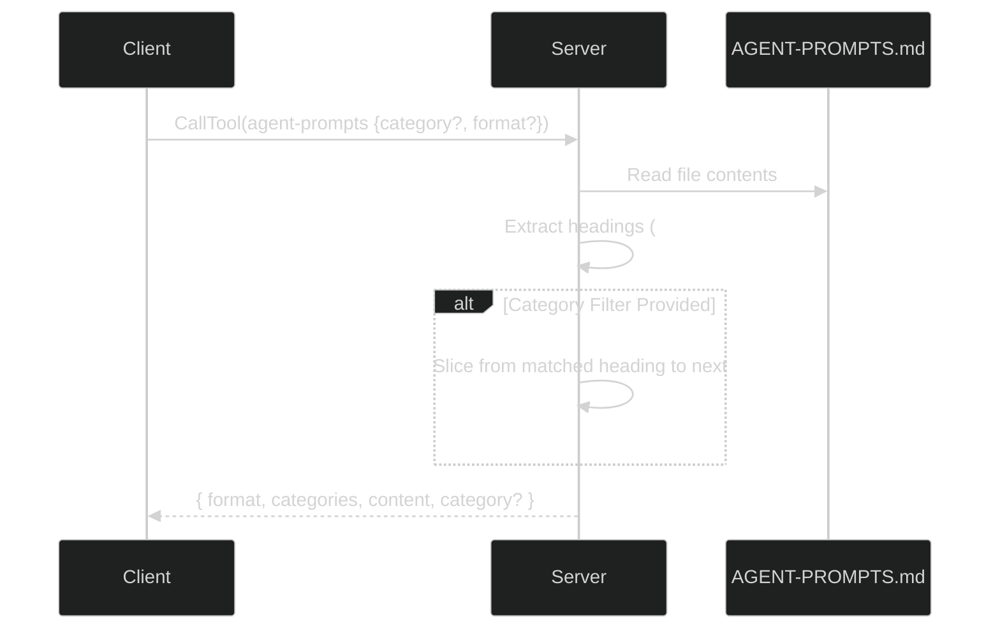
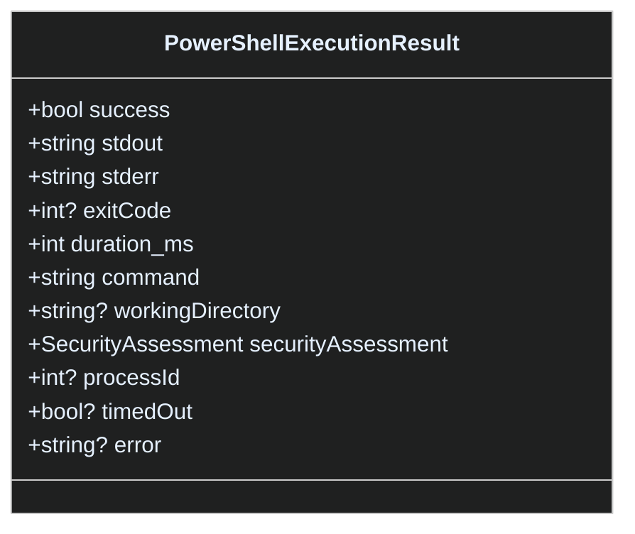

# PowerShell MCP Server Architecture & Logical Diagrams

> Comprehensive technical overview of the enterprise PowerShell MCP Server: component architecture, request lifecycle, security classification logic, enforcement pathways, observability flows, and auxiliary tooling.

---

## 1. High-Level Component Architecture



---

## 2. Request Lifecycle (Sequence)

```mermaid
%%{init: {'theme':'dark','themeVariables': { 'primaryColor': '#1e2730','primaryTextColor':'#e6f1ff','primaryBorderColor':'#4fa3ff','lineColor':'#6ea8ff','secondaryColor':'#2a3542','tertiaryColor':'#16202a','actorBkg':'#2a3542','actorBorder':'#4fa3ff','fontFamily':'Segoe UI,Inter,Arial'}}}%%
sequenceDiagram
    participant Client as MCP Client
    participant Server as MCP Server Core
    participant Auth as Auth Validator
    participant Rate as Rate Limiter
    participant Sec as Security Classifier
    participant Exec as PowerShell Executor
    participant Log as Audit Logger
    participant Metrics as Metrics Registry

    Client->>Server: CallTool (e.g. powershell-command)
    Server->>Auth: Validate key (optional)
    Auth-->>Server: ok / fail
    alt Auth Fail
        Server->>Client: McpError (InvalidRequest)
        Log-->>(Files): AUTH_FAILED
    else Auth OK
        Server->>Rate: consumeToken(parentPid)
        Rate-->>Server: allowed? remaining/reset
        alt Rate Exceeded
            Server->>Client: McpError (Rate Limit)
            Log-->>(Files): RATE_LIMIT_EXCEEDED
            Metrics-->>Dashboard: execution(blocked)
        else Within Limit
            Server->>Sec: classify(command)
            Sec-->>Server: SecurityAssessment
            alt Blocked Assessment
                Server->>Client: McpError (Blocked)
                Log-->>(Files): COMMAND_BLOCKED
                Metrics-->>Dashboard: execution(blocked)
            else Requires Confirmation (RISKY/UNKNOWN)
                alt confirmed flag missing
                    Server->>Client: McpError (Needs confirmed:true)
                    Log-->>(Files): CONFIRMATION_REQUIRED
                else confirmed present
                    Server->>Exec: spawn PowerShell
                    Exec-->>Server: ExecutionResult
                    Server->>Client: structured output
                    Log-->>(Files): COMMAND_EXECUTED
                    Metrics-->>Dashboard: execution(success/fail)
                end
            else Safe
                Server->>Exec: spawn PowerShell
                Exec-->>Server: ExecutionResult
                Server->>Client: structured output
                Log-->>(Files): COMMAND_EXECUTED
                Metrics-->>Dashboard: execution(success/fail)
            end
            Sec-->>Log: classification entry
            Sec-->>Metrics: increment counters
        end
    end
```

---

## 3. Security Classification Logic (Decision Flow)

```mermaid
%%{init: {'theme':'dark','themeVariables': { 'primaryColor': '#1e2730','primaryTextColor':'#e6f1ff','primaryBorderColor':'#ff7b72','lineColor':'#ffb347','secondaryColor':'#2a3542','tertiaryColor':'#16202a','fontFamily':'Segoe UI,Inter,Arial'}}}%%
flowchart TD
    A[Input Command] --> B[Alias Detection / Suspicious Patterns]
    B --> C{High-Risk Alias or Suspicious Pattern?}
    C -->|Yes| CRIT[CRITICAL (blocked)]
    C -->|No| D[Dynamic Pattern Merge (safe/risky/blocked)]
    D --> E{Matches BLOCKED Regex?}
    E -->|Yes| BLK[BLOCKED or CRITICAL depending pattern<br/>blocked=true]
    E -->|No| F{Matches Hardcoded Danger Fallback?}
    F -->|Yes| DANG[DANGEROUS<br/>blocked=true]
    F -->|No| G{Matches RISKY Regex?}
    G -->|Yes| RISKY[RISKY<br/>requiresPrompt=true]
    G -->|No| H{Matches SAFE Regex?}
    H -->|Yes| SAFE[SAFE<br/>execute directly]
    H -->|No| UNK[UNKNOWN<br/>requiresPrompt=true]
```

### Classification Outcomes

| Level       | Risk | blocked | requiresPrompt | Typical Color | Examples / Triggers |
|-------------|------|---------|----------------|---------------|----------------------|
| SAFE        | LOW  | false   | false          | GREEN         | Get-Process, Select-Object |
| RISKY       | MED  | false   | true           | YELLOW        | Remove-Item, Move-Item, Stop-Process |
| DANGEROUS   | HIGH | true    | n/a            | MAGENTA       | Format-Volume fallback, destructive ops |
| CRITICAL    | EXTREME | true | n/a            | RED           | EncodedCommand, Download + exec, hidden window |
| BLOCKED     | FORBIDDEN | true | n/a         | RED           | Registry writes, system file edits |
| UNKNOWN     | MED  | false   | true           | CYAN          | Anything unmatched |

### Blocking vs Confirmation

- **Blocked (DANGEROUS / CRITICAL / BLOCKED)**: Immediate denial; server returns McpError.
- **Confirmation Required (RISKY / UNKNOWN)**: Must include `confirmed: true` param; otherwise McpError instructs to add it.
- **Auto-Allow (SAFE)**: Executes without extra flags.

---

## 4. Rate Limiter (Token Bucket) Lifecycle



**Metrics Emitted:** blocked events, remaining tokens, resetMs. Logged under category `RATE_LIMIT_EXCEEDED` when denial occurs.

---

## 5. Working Directory Enforcement



Enforcement toggled via tools:

- `enforce-working-directory` (enable/disable)
- `get-working-directory-policy` (status + allowed roots)

---

## 6. Metrics & Observability Flow

```mermaid
%%{init: {'theme':'dark','themeVariables': { 'primaryColor': '#1e2730','primaryTextColor':'#e6f1ff','primaryBorderColor':'#58a6ff','lineColor':'#58a6ff','secondaryColor':'#2a3542','tertiaryColor':'#16202a'}}}%%
flowchart LR
    EXEC_EVENT[Execution Result] --> METR[metricsRegistry]
    CLASSIFY[Security Classification] --> METR
    THREAT[Unknown/Alias Tracking] --> METR
    METR --> SNAPSHOT[/api/metrics JSON]
    METR --> SSE[/events SSE Stream]
    SSE --> DASH[Browser Dashboard]
    LOGS[(Audit Logs)] --> (External Analysis)
```

Dashboard Visuals:

- Counters (by security level, blocked, truncated)
- Live event table (highlight confirmed=true)
- CPU & Event Loop Lag graph
- Memory (RSS / Heap) graph

---

## 7. Threat & Alias Tracking Data Model



- Each UNKNOWN command increments frequency and updates lastSeen.
- Alias detection logs alias resolution & risk.
- Suspicious patterns escalate to CRITICAL quickly.

---

## 8. Prompt Retrieval Tool (`agent-prompts`)



Supported formats:

- `markdown`: Returns raw section(s)
- `json`: Returns JSON serialized payload (useful for agents to parse categories & targeted content)

---

## 9. Tool Surface Overview

| Tool | Purpose | Security Interaction | Typical Use |
|------|---------|----------------------|-------------|
| powershell-command | Single command exec | Classify -> enforce | Quick info retrieval |
| powershell-script | Multi-line script | Classify each invocation | Aggregated logic |
| powershell-file | Execute .ps1 file | Classify path & content contextually | Existing scripts |
| powershell-syntax-check | Parser validation | No execution | Pre-flight safety |
| enforce-working-directory | Toggle WD policy | Administrative | Harden environment |
| get-working-directory-policy | Inspect policy | Read-only (SAFE) | Agent planning |
| server-stats | Metrics snapshot | Read-only (SAFE) | Health checks |
| threat-analysis | Threat stats | Read-only (SAFE) | Security review |
| ai-agent-test | Validation suite | SAFE + blocked expectations | Regression gating |
| help | Documentation | Safe | Hints & onboarding |
| agent-prompts | Reproduction prompts | Safe | Deterministic rebuild |

---

## 10. Execution Output Struct (Simplified)



---

## 11. Security Enforcement Summary

| Phase | Step | Condition | Action | Response Pattern |
|-------|------|-----------|--------|------------------|
| 1 | Auth | Key invalid (enterprise) | Reject | McpError AUTH_FAILED |
| 2 | Rate Limit | tokens == 0 | Reject + log + metrics | McpError RATE_LIMIT_EXCEEDED |
| 3 | Classification | blocked=true | Reject + log + metrics | McpError COMMAND_BLOCKED |
| 4 | Classification | requiresPrompt & !confirmed | Reject | McpError CONFIRMATION_REQUIRED |
| 5 | Execution | timeout | Kill process | error TIMEOUT |
| 6 | Output | size/lines exceed | Truncate | Append &lt;TRUNCATED&gt; marker |

---

## 12. Example Interaction Scenarios

### A. Safe Command

```json
{
    "tool": "powershell-command",
    "params": { "command": "Get-Date" }
}
```

- Classified SAFE → executes directly.
- Returns success, securityAssessment.level = SAFE.

### B. Risky Command Without Confirmation

```json
{
    "tool": "powershell-command",
    "params": { "command": "Remove-Item ./file.txt" }
}
```

- Classified RISKY → requiresPrompt.
- Missing `confirmed:true` → McpError advising to add confirmation.

### C. Risky Command With Confirmation

```json
{
    "tool": "powershell-command",
    "params": { "command": "Remove-Item ./file.txt", "confirmed": true }
}
```

- Executes; audit logs include confirmation intent.

### D. Critical Command Attempt

```json
{
    "tool": "powershell-command",
    "params": { "command": "powershell -EncodedCommand abc..." }
}
```

- Classified CRITICAL → blocked; no execution spawned.

### E. Unknown Command

```json
{
    "tool": "powershell-command",
    "params": { "command": "Custom-InternalThing" }
}
```

- Classified UNKNOWN → requiresPrompt.
- Tracked in unknownThreats map for frequency.

---

## 13. Dynamic Pattern Overrides

```mermaid
%%{init: {'theme':'dark','themeVariables': { 'primaryColor': '#1e2730','primaryTextColor':'#e6f1ff','primaryBorderColor':'#4fa3ff','lineColor':'#6ea8ff','secondaryColor':'#2a3542','tertiaryColor':'#16202a'}}}%%
flowchart LR
    DEFAULT[Built-in Pattern Sets] --> MERGE[Merge Layer]
    ADD_SAFE[additionalSafe[]] --> MERGE
    ADD_BLOCK[additionalBlocked[]] --> MERGE
    SUPPRESS[suppressPatterns[]] --> MERGE
    MERGE --> RUNTIME{mergedPatterns cache}
    RUNTIME --> CLASSIFY[classifyCommandSafety]
```

- Lazy initialization caches merged regex arrays (safe, risky, blocked).
- suppressPatterns filters out built-ins before compilation.

---

## 14. Operational Audit Surfaces

| Surface | Content | Format | Primary Use |
|---------|---------|--------|-------------|
| stderr | Human-readable log lines | Text | Real-time console monitoring |
| .log file | Pretty JSON entries | Text | Manual audit review |
| .ndjson | Structured line-delimited JSON | JSON | Machine ingestion (SIEM) |
| /api/metrics | Current metrics snapshot | JSON | Polling, dashboards |
| /events | Streaming events | SSE | Live UI updates |

---

## 15. Failure Modes & Mitigations

| Failure | Detection | Mitigation | Logged As |
|---------|-----------|-----------|----------|
| Auth failure | authKey mismatch | Reject request | AUTH_FAILED |
| Rate limit exceeded | token bucket empty | Backoff & retry | RATE_LIMIT_EXCEEDED |
| Blocked command | classification.blocked | Inform & suggest safe alternative | COMMAND_BLOCKED |
| Missing confirmation | requiresPrompt & !confirmed | Ask for confirmed:true | CONFIRMATION_REQUIRED |
| Timeout | exec duration > timeout | Kill process | TIMEOUT / TIMEOUT_AND_TRUNCATED |
| Excess output | bytes/lines > limit | Append truncate indicator | OUTPUT_TRUNCATED |

---

 
## 16. Quick Mental Model

> "Every request is a mini pipeline: Authenticate → Rate Limit → Classify → (Confirm?) → Execute → Log → Stream Metrics."

---

## 17. Extensibility Hooks

| Area | Extension Strategy |
|------|--------------------|
| New Tools | Add to tool list & switch in `CallTool` handler |
| New Security Patterns | Add dynamic config arrays (additionalBlocked) |
| Custom Compliance | Post-process NDJSON logs into SIEM pipeline |
| Advanced Metrics | Extend metricsRegistry & SSE payload schema |
| Plugin Prompts | Append new headings in `AGENT-PROMPTS.md` for tool retrieval |

---

## 18. Glossary

| Term | Definition |
|------|------------|
| SecurityAssessment | Structured result describing risk, level, reason, and enforcement flags. |
| requiresPrompt | Flag indicating user/agent must explicitly confirm execution. |
| blocked | Hard stop; command never reaches executor. |
| UnknownThreatEntry | Tracked record for unclassified commands. |
| Token Bucket | Rate limiting algorithm controlling request bursts over time. |
| NDJSON | Newline Delimited JSON, one JSON object per line. |

---

 
## 19. Summary

The server blends deterministic security classification, explicit confirmation semantics, rigorous audit logging, proactive threat tracking, and live observability. Diagrams above map each logical layer so agents and humans can reason about trust boundaries, side effects, and extension points.

---
End of Architecture Document
