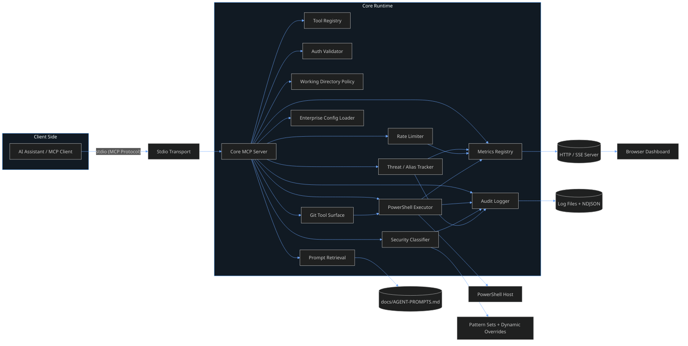
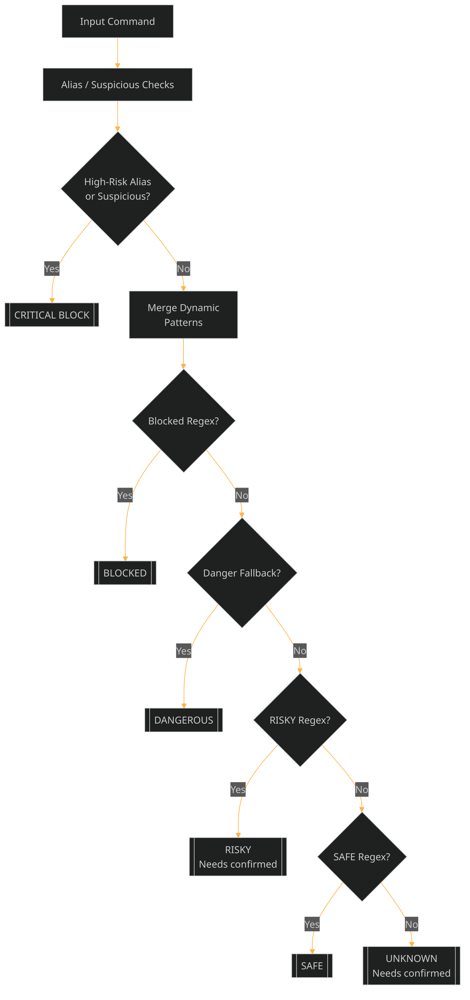
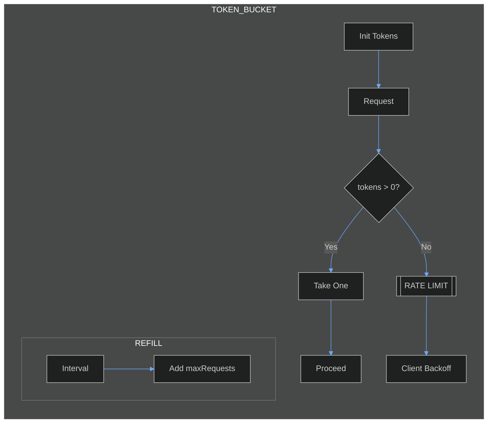
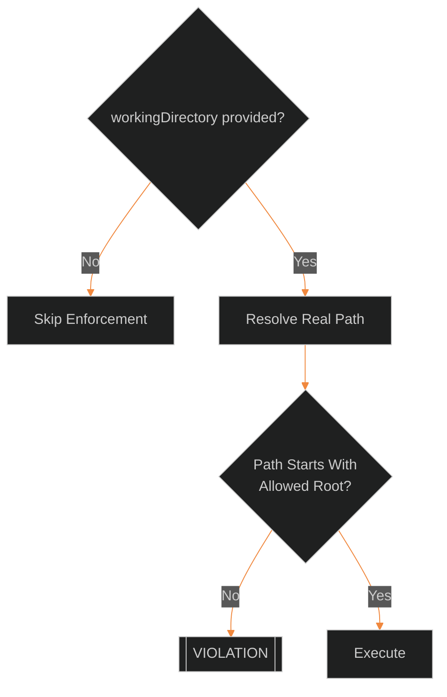
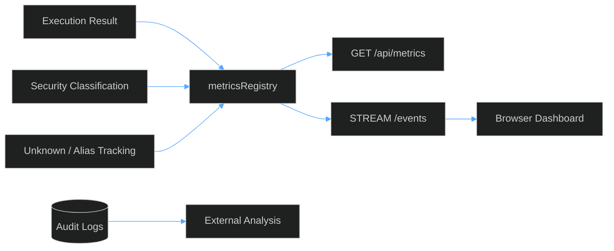
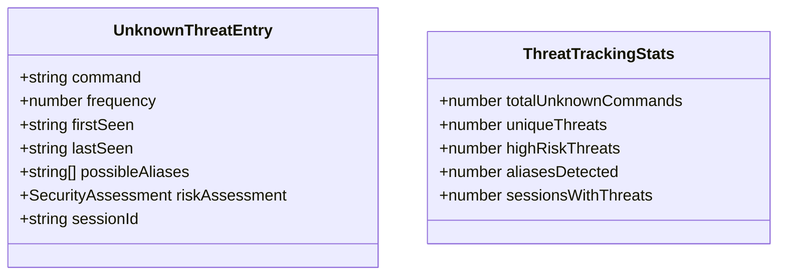
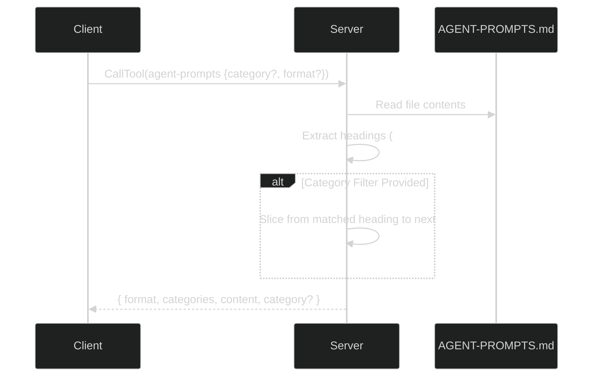
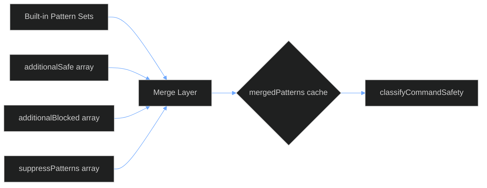

# PowerShell MCP Server Architecture & Logical Diagrams

> Comprehensive technical overview of the enterprise PowerShell MCP Server: component architecture, request lifecycle, security classification logic, enforcement pathways, observability flows, and auxiliary tooling.

---

## 1. High-Level Component Architecture (Updated Aug 2025)



---

## 2. Request Lifecycle (Sequence)

```mermaid
%%{init: {'theme':'dark','themeVariables': { 'primaryColor': '#1e2730','primaryTextColor':'#e6f1ff','primaryBorderColor':'#4fa3ff','lineColor':'#6ea8ff','secondaryColor':'#2a3542','tertiaryColor':'#16202a','actorBkg':'#2a3542','actorBorder':'#4fa3ff','fontFamily':'Segoe UI,Inter,Arial'}}}%%
sequenceDiagram
    participant Client as MCP Client
    participant Server as MCP Server Core
    participant Auth as Auth Validator
    participant Rate as Rate Limiter
    participant Sec as Security Classifier
    participant Exec as PowerShell Executor
    participant Log as Audit Logger
    participant Metrics as Metrics Registry

    Client->>Server: CallTool (e.g. powershell-command)
    Server->>Auth: Validate key (optional)
    Auth-->>Server: ok / fail
    alt Auth Fail
        Server->>Client: McpError (InvalidRequest)
        Log-->>(Files): AUTH_FAILED
    else Auth OK
        Server->>Rate: consumeToken(parentPid)
        Rate-->>Server: allowed? remaining/reset
        alt Rate Exceeded
            Server->>Client: McpError (Rate Limit)
            Log-->>(Files): RATE_LIMIT_EXCEEDED
            Metrics-->>Dashboard: execution(blocked)
        else Within Limit
            Server->>Sec: classify(command)
            Sec-->>Server: SecurityAssessment
            alt Blocked Assessment
                Server->>Client: McpError (Blocked)
                Log-->>(Files): COMMAND_BLOCKED
                Metrics-->>Dashboard: execution(blocked)
            else requires confirmed:true (RISKY/UNKNOWN)
                alt confirmed flag missing
                    Server->>Client: McpError (Needs confirmed:true)
                    Log-->>(Files): CONFIRMED_REQUIRED
                else confirmed present
                    Server->>Exec: spawn PowerShell
                    Exec-->>Server: ExecutionResult
                    Server->>Client: structured output
                    Log-->>(Files): COMMAND_EXECUTED
                    Metrics-->>Dashboard: execution(success/fail)
                end
            else Safe
                Server->>Exec: spawn PowerShell
                Exec-->>Server: ExecutionResult
                Server->>Client: structured output
                Log-->>(Files): COMMAND_EXECUTED
                Metrics-->>Dashboard: execution(success/fail)
            end
            Sec-->>Log: classification entry
            Sec-->>Metrics: increment counters
        end
    end
```

---

## 3. Security Classification Logic (Decision Flow)



### Classification Outcomes

| Level       | Risk | blocked | requiresPrompt | Typical Color | Examples / Triggers |
|-------------|------|---------|----------------|---------------|----------------------|
| SAFE        | LOW  | false   | false          | GREEN         | Get-Process, Select-Object |
| RISKY       | MED  | false   | true           | YELLOW        | Remove-Item, Move-Item, Stop-Process |
| DANGEROUS   | HIGH | true    | n/a            | MAGENTA       | Format-Volume fallback, destructive ops |
| CRITICAL    | EXTREME | true | n/a            | RED           | EncodedCommand, Download + exec, hidden window |
| BLOCKED     | FORBIDDEN | true | n/a         | RED           | Registry writes, system file edits |
| UNKNOWN     | MED  | false   | true           | CYAN          | Anything unmatched |

### Blocking vs confirmed

- **Blocked (DANGEROUS / CRITICAL / BLOCKED)**: Immediate denial; server returns McpError.
- **confirmed Required (RISKY / UNKNOWN)**: Must include `confirmed: true` param; otherwise McpError instructs to add it.
- **Auto-Allow (SAFE)**: Executes without extra flags.

---

## 4. Rate Limiter (Token Bucket) Lifecycle



**Metrics Emitted:** blocked events, remaining tokens, resetMs. Logged under category `RATE_LIMIT_EXCEEDED` when denial occurs.

---

## 5. Working Directory Enforcement



Enforcement toggled via tools:

- `enforce-working-directory` (enable/disable)
- `get-working-directory-policy` (status + allowed roots)

---

## 6. Metrics & Observability Flow



Dashboard Visuals:

- Counters (by security level, blocked, truncated)
- Live event table (highlight confirmed=true)
- CPU & Event Loop Lag graph
- Memory (RSS / Heap) graph
- PowerShell per-invocation metrics columns (CPU seconds, Working Set MB) when feature flag enabled

### 6.1 PowerShell Process Metrics Aggregation (Feature-Flagged)

When `limits.capturePsProcessMetrics` (or env `MCP_CAPTURE_PS_METRICS=1`) is active, each PowerShell invocation appends a sentinel JSON object containing lightweight process stats (cumulative CPU time seconds and working set). The executor strips this sentinel from stdout, parses it, and forwards the numeric values to:

1. `metricsHttpServer.publishExecution` (per-row `psMetrics` for live table columns `PS CPU(s)` & `WS(MB)`).
2. `metricsRegistry.record()` as `psCpuSec` / `psWSMB` which aggregate into arrays.

The registry snapshot then surfaces aggregated fields:

| Field | Meaning |
|-------|---------|
| `psSamples` | Number of invocations with metrics captured |
| `psCpuSecAvg` | Mean CPU seconds per invocation |
| `psCpuSecP95` | 95th percentile CPU seconds |
| `psWSMBAvg` | Mean Working Set MB |
| `psWSMBP95` | 95th percentile Working Set MB |

Dashboard cards for these stay hidden until `psSamples > 0` to avoid empty noise when disabled.

Reset Strategy: Currently only a process restart or future planned reset endpoint clears arrays (no implicit decay). Consumers should snapshot externally if needing long‑term trends.

---

## 7. Threat & Alias Tracking Data Model



- Each UNKNOWN command increments frequency and updates lastSeen.
- Alias detection logs alias resolution & risk.
- Suspicious patterns escalate to CRITICAL quickly.

---

## 8. Prompt Retrieval Tool (`agent-prompts`)



Supported formats:

- `markdown`: Returns raw section(s)
- `json`: Returns JSON serialized payload (useful for agents to parse categories & targeted content)

---

## 9. Tool Surface Overview

| Tool | Purpose | Schema Validation | Typical Use |
|------|---------|-------------------|-------------|
| `run-powershell` | Execute PowerShell command/script | Zod schema with security classification | Command execution, script automation |
| `admin` | Administrative operations via hierarchical actions | Unified schema covering all admin functions | Server management, security policy, learning |
| `syntax-check` | Validate PowerShell syntax without execution | Script or filePath validation | Pre-flight syntax validation |
| `help` | Interactive help and documentation | Topic-based help retrieval | User assistance, capability discovery |

### Administrative Tool Hierarchy (`admin`)

The `admin` tool provides structured access to all administrative functions:

- **`action: "server"`** → Server metrics, health, memory management
- **`action: "security"`** → Working directory policy, threat analysis  
- **`action: "learning"`** → Command learning queue management
- **`action: "audit"`** → Logging and prompt library access

This hierarchical approach reduces tool surface complexity while maintaining full functionality access.

---

## 10. Execution Output Struct (Simplified)

```mermaid
%%{init: {"theme":"dark","themeVariables": { 
    "primaryColor": "#1e2730",
    "primaryTextColor":"#e6f1ff",
    "primaryBorderColor":"#4fa3ff",
    "lineColor":"#6ea8ff",
    "secondaryColor":"#2a3542",
    "tertiaryColor":"#16202a",
    "noteBkgColor":"#2d3640",
    "noteTextColor":"#e6f1ff",
    "classTextColor":"#e6f1ff",
    "classTitleColor":"#ffffff",
    "classBackground":"#1e2730",
    "classBorderColor":"#4fa3ff",
    "fontFamily":"Segoe UI,Inter,Arial"
}}%%
classDiagram
    class PowerShellExecutionResult {
        +bool success
        +string stdout
        +string stderr
        +int? exitCode
        +int duration_ms            // wall‑clock (>=1ms enforced for real executions)
        +int configuredTimeoutMs
        +int effectiveTimeoutMs     // after adaptive extensions
        +int adaptiveExtensions     // count of extensions applied
        +bool adaptiveExtended      // shorthand (adaptiveExtensions > 0)
        +int? adaptiveMaxTotalMs
        +string terminationReason   // completed | timeout | killed | output_overflow
        +bool timedOut
        +bool internalSelfDestruct  // exited via internal timer (exitCode 124)
        +string overflowStrategy    // return | truncate | terminate
        +bool truncated             // output truncated due to size/line limits
        +bool overflow              // raw overflow trigger before strategy applied
        +int totalBytes             // cumulative (pre truncate) bytes captured
        +object psProcessMetrics    // { CpuSec, WS } when enabled
        +SecurityAssessment securityAssessment
        +int originalTimeoutSeconds
        +string[] warnings          // deprecation & long-timeout notices
        +string? workingDirectory
        +object[] chunks            // internal chunk boundary metadata (not always returned)
        +string? reason             // legacy alias for certain overflow cases
    }
```

---

## 11. Security Enforcement Summary

| Phase | Step | Condition | Action | Response Pattern |
|-------|------|-----------|--------|------------------|
| 1 | Auth | Key invalid (enterprise) | Reject | McpError AUTH_FAILED |
| 2 | Rate Limit | tokens == 0 | Reject + log + metrics | McpError RATE_LIMIT_EXCEEDED |
| 3 | Classification | blocked=true | Reject + log + metrics | McpError COMMAND_BLOCKED |
| 4 | Classification | requiresPrompt & !confirmed | Reject | McpError CONFIRMED_REQUIRED |
| 5 | Execution | timeout | Kill process | error TIMEOUT |
| 6 | Output | size/lines exceed | Truncate | Append &lt;TRUNCATED&gt; marker |
| 7 | Metrics | real execution duration <1ms | Force to 1ms | Avoid misleading 0ms rows |

---

## 12. Example Interaction Scenarios

### A. Safe Command

```json
{
    "tool": "powershell-command",
    "params": { "command": "Get-Date" }
}
```

- Classified SAFE → executes directly.
- Returns success, securityAssessment.level = SAFE.

### B. Risky Command Without confirmed

```json
{
    "tool": "powershell-command",
    "params": { "command": "Remove-Item ./file.txt" }
}
```

- Classified RISKY → requiresPrompt.
- Missing `confirmed:true` → McpError advising to add confirmed.

### C. Risky Command With confirmed

```json
{
    "tool": "powershell-command",
    "params": { "command": "Remove-Item ./file.txt", "confirmed": true }
}
```

- Executes; audit logs include confirmed intent.

### D. Critical Command Attempt

```json
{
    "tool": "powershell-command",
    "params": { "command": "powershell -EncodedCommand abc..." }
}
```

- Classified CRITICAL → blocked; no execution spawned.

### E. Unknown Command

```json
{
    "tool": "powershell-command",
    "params": { "command": "Custom-InternalThing" }
}
```

- Classified UNKNOWN → requiresPrompt.
- Tracked in unknownThreats map for frequency.

---

## 13. Dynamic Pattern Overrides



- Lazy initialization caches merged regex arrays (safe, risky, blocked).
- suppressPatterns filters out built-ins before compilation.

---

## 14. Operational Audit Surfaces

| Surface | Content | Format | Primary Use |
|---------|---------|--------|-------------|
| stderr | Human-readable log lines | Text | Real-time console monitoring |
| .log file | Pretty JSON entries | Text | Manual audit review |
| .ndjson | Structured line-delimited JSON | JSON | Machine ingestion (SIEM) |
| /api/metrics | Current metrics snapshot | JSON | Polling, dashboards |
| /events | Streaming events | SSE | Live UI updates |

---

## 15. Failure Modes & Mitigations

| Failure | Detection | Mitigation | Logged As |
|---------|-----------|-----------|----------|
| Auth failure | authKey mismatch | Reject request | AUTH_FAILED |
| Rate limit exceeded | token bucket empty | Backoff & retry | RATE_LIMIT_EXCEEDED |
| Blocked command | classification.blocked | Inform & suggest safe alternative | COMMAND_BLOCKED |
| Missing confirmed | requiresPrompt & !confirmed | Ask for confirmed:true | CONFIRMED_REQUIRED |
| Timeout | exec duration > timeout | Kill process | TIMEOUT / TIMEOUT_AND_TRUNCATED |
| Excess output | bytes/lines > limit | Append truncate indicator | OUTPUT_TRUNCATED |

---

 
## 16. Quick Mental Model

> "Every request is a mini pipeline: Authenticate → Rate Limit → Classify → (confirmed?) → Execute → Log → Stream Metrics."

Additional nuance as of Aug 2025:

- Blocked or confirmed-required (unconfirmed) requests still emit a lightweight metrics attempt event, but their zero-duration samples are excluded from latency percentiles/averages.
- Real executions enforce a minimum reported duration of 1ms (high-resolution timer) to prevent a wall of 0ms rows obscuring distribution shape.
- Adaptive timeout logic can extend effectiveTimeoutMs in small steps while honoring a hard max (adaptiveMaxTotalMs) and watchdog.

---

## 16.1 Timeout & Adaptive Extension Mechanics

| Element | Behavior |
|---------|----------|
| Internal Self‑Destruct | Injected timer (unless MCP_DISABLE_SELF_DESTRUCT=1) exits PowerShell (exit 124) shortly before external timeout / adaptive horizon. |
| External Timeout | Initial window derived from timeoutSeconds. |
| Adaptive Window | When remaining <= extendWindowMs AND recent output activity, extend by extendStepMs. |
| Cap | Never extends beyond adaptiveMaxTotalMs (derived from user input or 3x base timeout, capped at 180s). |
| terminationReason | Derived atomically at finish(): `completed` \| `timeout` \| `killed` \| `output_overflow`. |
| Watchdog | Forces resolution hardKillTotal ms after start (accounts for adaptive horizon + grace). |

---

## 16.2 Environment Variables Influencing Execution

| Variable | Effect |
|----------|-------|
| MCP_CAPTURE_PS_METRICS=1 | Enable per-invocation PowerShell CPU / WS sampling (with fallback baseline samples). |
| MCP_DISABLE_SELF_DESTRUCT=1 | Disables injected internal 124 self-destruct timer (useful for debugging). |
| MCP_OVERFLOW_STRATEGY=(return\|truncate\|terminate) | Chooses overflow handling approach (default return). |
| METRICS_DEBUG=true | Emits verbose metrics sampling / fallback logs to stderr. |

---

## 16.3 Timeout Parameter Aliases & Deprecations

Canonical field: timeoutSeconds (seconds).

Accepted aliases (with warnings):

| Alias | Status | Warning Text |
|-------|--------|--------------|
| timeoutSeconds | Active | Primary timeout parameter (seconds). |

Long timeouts (>=60s) add a performance responsiveness warning.

---

## 16.4 Metrics Duration Semantics

| Scenario | Duration Contribution |
|----------|-----------------------|
| Blocked command | Recorded attempt event (durationMs=0) but excluded from latency aggregates. |
| confirmed required (unconfirmed) | Same as blocked (excluded). |
| Successful / failed real exec | High-resolution measured; coerced to >=1ms; included in aggregates. |
| Adaptive extensions | Reflected in effectiveTimeoutMs; duration_ms remains actual wall time. |

Percentiles (p95) use a ceil index over sorted non-zero durations to avoid downward bias for small sample sets.

---

## 17. Extensibility Hooks

| Area | Extension Strategy |
|------|--------------------|
| New Tools | Add to tool list & switch in `CallTool` handler |
| New Security Patterns | Add dynamic config arrays (additionalBlocked) |
| Custom Compliance | Post-process NDJSON logs into SIEM pipeline |
| Advanced Metrics | Extend metricsRegistry & SSE payload schema |
| Plugin Prompts | Append new headings in `AGENT-PROMPTS.md` for tool retrieval |

---

## 18. Glossary

| Term | Definition |
|------|------------|
| SecurityAssessment | Structured result describing risk, level, reason, and enforcement flags. |
| requiresPrompt | Flag indicating user/agent must explicitly confirmed execution. |
| blocked | Hard stop; command never reaches executor. |
| UnknownThreatEntry | Tracked record for unclassified commands. |
| Token Bucket | Rate limiting algorithm controlling request bursts over time. |
| NDJSON | Newline Delimited JSON, one JSON object per line. |

---

 
## 19. Summary

The server blends deterministic security classification, explicit confirmed semantics, rigorous audit logging, proactive threat tracking, and live observability. Diagrams above map each logical layer so agents and humans can reason about trust boundaries, side effects, and extension points.

### Timeout Escalation (Implementation Note)

Execution timeouts now perform a two‑stage termination: SIGTERM at the configured threshold followed by an automatic SIGKILL escalation after a short grace window (min 2s, max 5s, ~10% of timeout). Metrics record each timeout (TIMEOUTS counter) and dashboard rows display a TIMEOUT marker when `timedOut=true`.

---
End of Architecture Document
