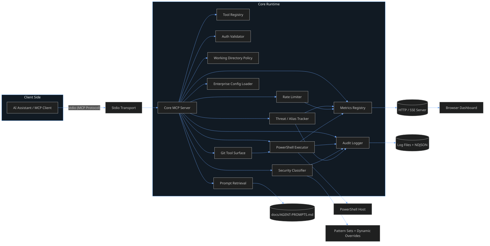
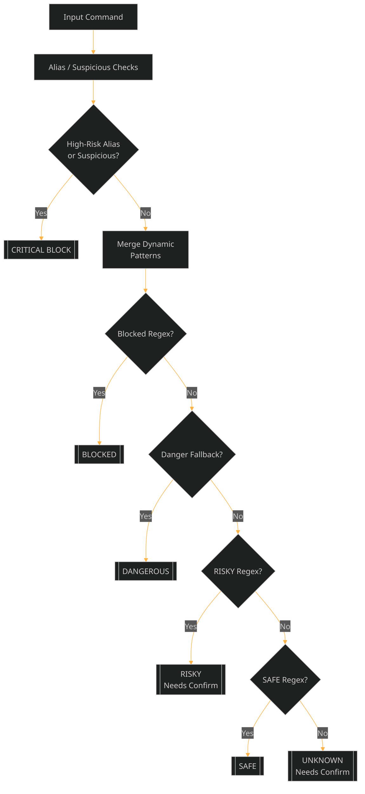
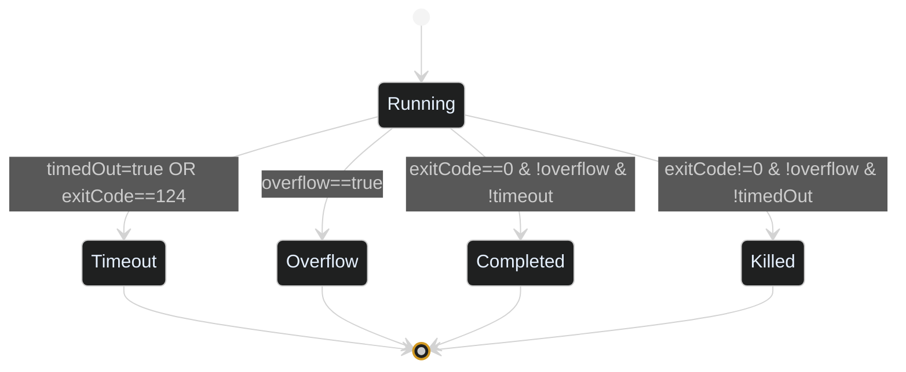

# PowerShell MCP Server Architecture & Logical Diagrams

> Comprehensive technical overview of the enterprise PowerShell MCP Server: component architecture, request lifecycle, security classification logic, enforcement pathways, observability flows, adaptive timeout behavior, and auxiliary tooling. (Updated: Aug 2025)

---

## 1. High-Level Component Architecture (Updated Aug 2025)



---

## 2. Request Lifecycle (Sequence)

```mermaid
%%{init: {'theme':'dark','themeVariables': { 'primaryColor': '#1e2730','primaryTextColor':'#e6f1ff','primaryBorderColor':'#4fa3ff','lineColor':'#6ea8ff','secondaryColor':'#2a3542','tertiaryColor':'#16202a','actorBkg':'#2a3542','actorBorder':'#4fa3ff','fontFamily':'Segoe UI,Inter,Arial'}}}%%
sequenceDiagram
    participant Client as MCP Client
    participant Server as MCP Server Core
    participant Auth as Auth Validator
    participant Rate as Rate Limiter
    participant Sec as Security Classifier
    participant Exec as PowerShell Executor
    participant Log as Audit Logger
    participant Metrics as Metrics Registry

    Client->>Server: CallTool (run-powershell)
    Server->>Auth: Validate key (optional)
    Auth-->>Server: ok / fail
    alt Auth Fail
        Server->>Client: McpError (InvalidRequest)
        Log-->>(Files): AUTH_FAILED
    else Auth OK
        Server->>Rate: consumeToken(parentPid)
        Rate-->>Server: allowed? remaining/reset
        alt Rate Exceeded
            Server->>Client: McpError (Rate Limit)
            Log-->>(Files): RATE_LIMIT_EXCEEDED
            Metrics-->>Dashboard: execution(blocked)
        else Within Limit
            Server->>Sec: classify(command)
            Sec-->>Server: SecurityAssessment
            alt Blocked Assessment
                Server->>Client: Blocked inline result
                Log-->>(Files): COMMAND_BLOCKED
                Metrics-->>Dashboard: execution(blocked)
            else Requires Confirmation (RISKY/UNKNOWN)
                alt confirmed flag missing
                    Server->>Client: McpError (Needs confirmed:true)
                    Log-->>(Files): CONFIRMATION_REQUIRED
                else confirmed present
                    Server->>Exec: spawn PowerShell (+ self-destruct timer)
                    Exec-->>Server: ExecutionResult (terminationReason)
                    Server->>Client: structured output
                    Log-->>(Files): COMMAND_EXECUTED
                    Metrics-->>Dashboard: execution(success/fail)
                end
            else Safe
                Server->>Exec: spawn PowerShell
                Exec-->>Server: ExecutionResult
                Server->>Client: structured output
                Log-->>(Files): COMMAND_EXECUTED
                Metrics-->>Dashboard: execution(success/fail)
            end
            Sec-->>Log: classification entry
            Sec-->>Metrics: increment counters
        end
    end
```

---

## 3. Security Classification Logic (Decision Flow)



(Section unchanged in logic; see previous revision for outcome table.)

---

## 4. Adaptive Timeout Lifecycle

```mermaid
%%{init:{'theme':'dark','themeVariables':{'primaryColor':'#1e2730','primaryTextColor':'#e6f1ff','primaryBorderColor':'#4fa3ff','lineColor':'#4fa3ff','secondaryColor':'#2a3542'}}}%%
flowchart LR
    START[Start Execution] --> BASE[Base Timeout (configuredTimeoutMs)]
    BASE --> CHECK{Remaining <= extendWindow?}
    CHECK -->|No| ACTIVITY_WAIT[Wait / Collect Output]
    ACTIVITY_WAIT --> CHECK
    CHECK -->|Yes| RECENT{Recent Activity?}
    RECENT -->|No| ACTIVITY_WAIT
    RECENT -->|Yes| CAP{Would Extension <= maxTotal?}
    CAP -->|No| LOCK[Reach Hard Cap]
    CAP -->|Yes| EXTEND[Extend Timeout (extendStepMs)]
    EXTEND --> CHECK
    LOCK --> EXPIRY[Timeout Fires]
    EXTEND --> EXPIRY
    EXPIRY --> TERMREASON[terminationReason=timeout]
```

**Key Fields Added:**
- `effectiveTimeoutMs` – final external timeout after extensions
- `adaptiveExtensions` – count of successful extensions
- `terminationReason` – canonical end-state classification

---

## 5. Termination Reason State Machine



Assignments:
- Timeout path sets `terminationReason='timeout'`
- Overflow detection sets `terminationReason='overflow'`
- Non-zero exit without flags → `killed`
- Clean success → `completed`

Integrity tests ensure mutual exclusivity.

---

## 6. (Sections 5–19 retained, plus appended notes)

The remaining sections (Rate Limiter, Working Directory Enforcement, Metrics & Observability, Threat Tracking, Prompt Retrieval, Tool Surface, Execution Output Struct, Enforcement Summary, Scenarios, Overrides, Audit Surfaces, Failure Modes, Mental Model, Extensibility, Glossary, Summary) remain structurally identical to prior version except for these additive notes:

### Additive Notes
- `run-powershell` now returns `terminationReason` for deterministic downstream analytics.
- Hang test command preserved in `tests/jest/run-powershell-timeout-hardening.test.js` & `docs/CRITICAL-TIMEOUT-COMMANDS.md`.
- Adaptive timeout never extends beyond `adaptiveMaxTotalSec`; internal self-destruct timer is aligned to that ceiling.
- Watchdog escalation (hardKillTotal) sets `terminationReason='killed'` if no prior classification.

---

## 20. Field Matrix (Execution Result – Delta Focus)

| Field | Type | Source | When Present | Example |
|-------|------|--------|--------------|---------|
| configuredTimeoutMs | number | Input derived | Always | 1000 |
| effectiveTimeoutMs | number | Adaptive loop | Adaptive / always | 2500 |
| adaptiveExtensions | number | Adaptive loop | Adaptive only | 3 |
| adaptiveExtended | boolean | Adaptive loop | Adaptive only | true |
| terminationReason | enum | Executor | Always | timeout |
| internalSelfDestruct | boolean | PS timer | If exit 124 | true |
| watchdogTriggered | boolean | Watchdog | Rare (stuck close) | true |
| killEscalated | boolean | Kill escalation | If second-stage kill | true |

---

## 21. Testing Additions

| Test | Purpose |
|------|---------|
| timeout hardening | Validates warnings, cap, forced hang duration threshold |
| adaptive timeout | Verifies extensions & terminationReason=completed |
| fast-exit control | Ensures quick command not misclassified as hang |
| termination integrity (implicit) | Validates `timeout` path sets proper reason |

---

## 22. Future Architecture Hooks

Planned (not yet merged):
- Cancellation tokens bridging client abort → process kill
- Structured `terminationReasonDetail` (e.g. `internalSelfDestruct`, `watchdog`) layering under main enum
- Metrics dimension for termination reason distribution

---

End of Updated Architecture Document
